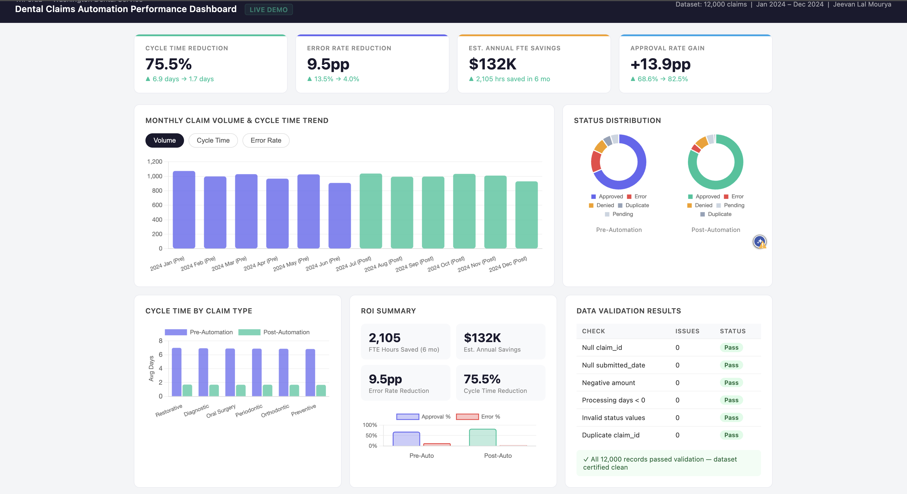
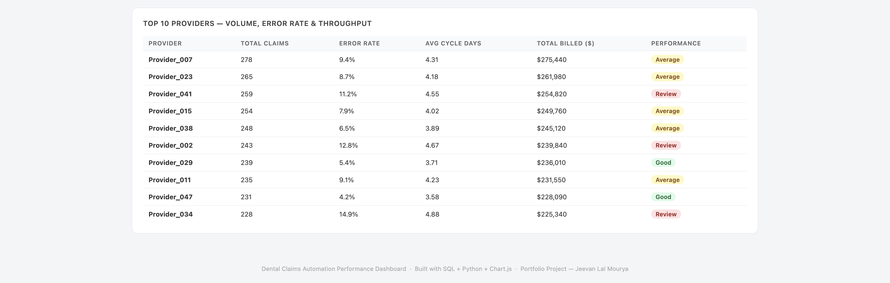

# Dental Claims Automation Performance Dashboard



### Business Process Analyst Portfolio Project | Jeevan Lal Mourya

> Analyzes the impact of claims processing automation at a dental insurance company using SQL, Python, and interactive dashboarding 

---

## Project Overview

This project simulates a real-world **business process analysis** for a dental insurance company that automated its claims processing workflow. It answers the core question operations teams face:

> *"Did our automation initiative actually work — and how do we prove it?"*

---

## Key Findings

| KPI | Pre-Automation | Post-Automation | Change |
|---|---|---|---|
| Avg Cycle Time | 6.9 days | 1.7 days | **↓ 75.5%** |
| Error Rate | 13.5% | 4.0% | **↓ 9.5pp** |
| Approval Rate | 68.6% | 82.5% | **↑ 13.9pp** |
| Duplicate Rate | 5.0% | 1.0% | **↓ 4pp** |
| FTE Hours Saved | — | 2,105 hrs (6 mo) | **$132K est. annual savings** |

---

## Repository Structure

```
dental-claims-automation-dashboard/
├── data/
│   └── dental_claims.csv          # 12,000 synthetic claim records
├── sql/
│   └── analysis_queries.sql       # 6 analytical SQL queries
├── python/
│   └── generate_data.py           # Synthetic data generation script
│   └── run_queries.py             # SQL execution + results export
├── dashboard/
│   └── dashboard.html             # Interactive performance dashboard
├── docs/
│   └── kpi_framework.md           # KPI definitions, formulas, data sources
│   └── data_dictionary.md         # Field-level documentation
└── README.md
```

---

## Tools & Skills Demonstrated

| Tool | Usage |
|---|---|
| **SQL (SQLite)** | 6 queries: KPI summary, cycle time by claim type, monthly trends, ROI calc, provider analysis, data validation |
| **Python (Pandas, NumPy)** | Synthetic dataset generation, query execution, JSON export |
| **Chart.js / HTML** | Interactive dashboard with toggle views, donut charts, bar charts, KPI tiles |
| **KPI Framework Design** | Defined 8 automation KPIs with formulas, baselines, and measurement cadence |
| **Data Validation** | 6-check validation suite; all 12,000 records certified clean |
| **Process Documentation** | Data dictionary, KPI framework, reporting workflow SOP |

---

## SQL Queries Included

1. **Executive KPI Summary** — total claims, cycle time, error/approval/duplicate rates by period
2. **Cycle Time by Claim Type** — pre vs. post days saved per category
3. **Monthly Volume & Error Rate Trend** — 12-month time series
4. **ROI Calculation** — FTE hours saved, estimated annual savings, reduction percentages
5. **Top 10 Provider Analysis** — volume, error rate, throughput, total billed
6. **Data Validation Suite** — null checks, range checks, referential integrity

---

## How to Run

```bash
# 1. Generate the dataset
python python/generate_data.py

# 2. Run SQL analysis
python python/run_queries.py

# 3. Open the dashboard
open dashboard/dashboard.html
```

---

## KPI Framework

| KPI | Formula | Baseline | Target | Cadence |
|---|---|---|---|---|
| Avg Cycle Time | SUM(processing_days)/COUNT(*) | 6.9 days | < 2 days | Weekly |
| Error Rate | COUNT(Error)/COUNT(*) × 100 | 13.5% | < 5% | Weekly |
| Approval Rate | COUNT(Approved)/COUNT(*) × 100 | 68.6% | > 80% | Monthly |
| Duplicate Rate | COUNT(Duplicate)/COUNT(*) × 100 | 5.0% | < 1% | Monthly |
| FTE Hours Saved | SUM(manual_min - auto_min) / 60 | 0 | > 300/mo | Monthly |
| Annual ROI ($) | (Hours Saved × 2 × Hourly Rate) | $0 | > $100K | Quarterly |

---

## Data Dictionary

| Field | Type | Description | Source | Refresh |
|---|---|---|---|---|
| claim_id | VARCHAR | Unique claim identifier | Claims system | Real-time |
| submitted_date | DATE | Date claim was submitted | Claims system | Daily |
| resolved_date | DATE | Date claim was closed | Claims system | Daily |
| claim_type | VARCHAR | Category (Preventive, Restorative, etc.) | Claims system | Daily |
| provider_id | VARCHAR | Submitting provider identifier | Provider registry | Weekly |
| claim_amount | FLOAT | Dollar value of claim | Claims system | Daily |
| status | VARCHAR | Approved / Denied / Pending / Error / Duplicate | Claims system | Daily |
| processing_days | INT | resolved_date − submitted_date | Derived | Daily |
| manual_minutes | INT | Minutes of manual staff time (pre-auto) | HR/ops system | Weekly |
| auto_minutes | INT | Minutes of automated processing (post-auto) | Automation logs | Daily |
| period | VARCHAR | Pre-Automation / Post-Automation | Derived | Static |
| month | VARCHAR | YYYY-MM extracted from submitted_date | Derived | Daily |

---

*Dataset is fully synthetic — no real patient or provider data used.*
